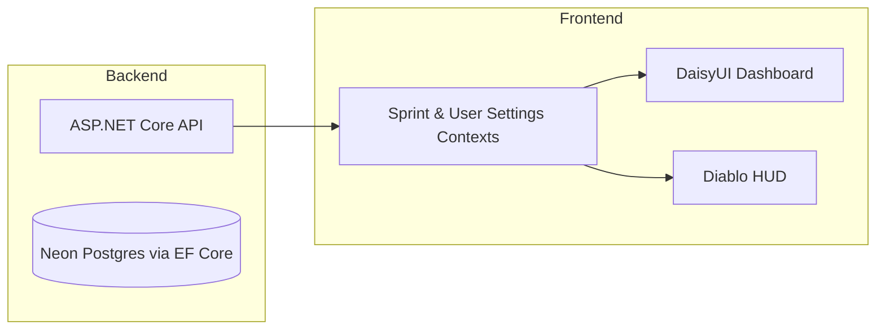
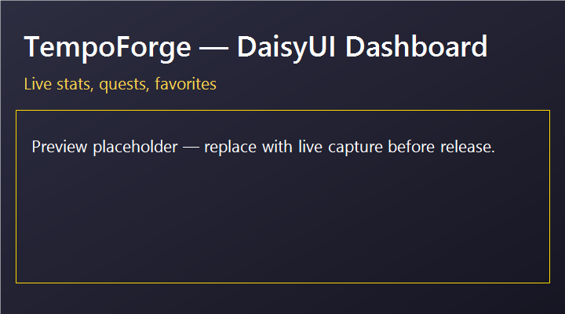
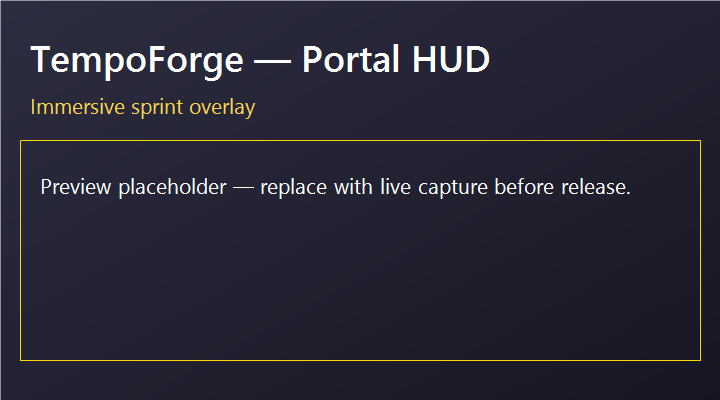

# TempoForge

  

TempoForge is a full-stack focus and sprint tracker that blends productivity coaching with light RPG feedback loops. The primary DaisyUI dashboard delivers a clean, actionable overview for ongoing sprints, while an optional Diablo-style HUD skin provides an immersive alternate layout that draws from the same sprint state.

---

## Feature Checklist

- [x] RESTful sprint lifecycle covering start, abort, complete, and recent history (`/api/sprints/*`)
- [x] Live stats endpoints for today + long-term progression (`/api/stats/today`, `/api/stats/progress`)
- [x] QuestService pipeline with active quest API (`/api/quests/active`, `/api/quests/{id}/claim`)
- [x] Favorites and recent cards backed by real data (`/api/projects/favorites`, `/api/sprints/recent`)
- [x] DaisyUI dashboard as the default UX; HUD toggle gated to non-production builds
- [x] TestContainers-backed integration tests plus QuestService unit coverage

---

## Scope Management

- DaisyUI dashboard is the grading-safe baseline and the default production experience.
- Diablo HUD remains an opt-in skin accessible only in non-production builds unless explicitly enabled.
- Further HUD/gamification experiments continue in a separate branch to keep the submission aligned with KISS/YAGNI.

---

## Architecture Snapshot



---

## Project Overview
- Track focus sessions, sprint outcomes, and productivity stats in one place.
- DaisyUI dashboard ships as the primary UI, optimized for clarity and quick navigation.
- Diablo HUD skin can be toggled on for an immersive alternative without branching business logic.
- Gamification layers (streaks, quests, ranks) reinforce daily habit loops and highlight progression.
- Backend and frontend remain decoupled so either side can evolve independently.

## Tech Stack

### Backend
- .NET 8, ASP.NET Core REST controllers
- Entity Framework Core with the Npgsql provider for PostgreSQL (Neon)
- Swagger/OpenAPI for contract exploration
- xUnit with TestContainers-powered integration suites

### Frontend
- React 18 with Vite and TypeScript
- Tailwind CSS + DaisyUI themes and components
- Shared contexts (SprintContext, UserSettingsContext) for timer, layout, and theme persistence
- Lucide Icons for adaptive iconography

### Deployment & Ops
- Docker images for API (`tempoforge-api`) and client (`tempoforge-web`)
- Fly.io for hosting orchestrated containers
- Neon Postgres as the managed database tier

## Getting Started (Local)

### Clone the Repository
```bash
git clone https://github.com/your-org/tempoforge.git
cd tempoforge
```

### Backend API
```bash
dotnet restore
dotnet build TempoForge.sln
dotnet run --project server/TempoForge.Api/TempoForge.Api.csproj
```
- API serves `http://localhost:5000`; Swagger UI lives at `http://localhost:5000/swagger`.

### Frontend Client
```bash
cd client/tempoforge-web
npm install
npm run dev
```
- Vite dev server defaults to `http://localhost:5173`.

### Environment Variables
- `ConnectionStrings__Default` — Neon Postgres connection string for the API.
- `VITE_API_BASE_URL` — Base URL the client uses to call the API (e.g., `http://localhost:5000`).
- Configure via `.env`, `dotnet user-secrets`, or Fly.io secret stores; never commit credentials.

## Containerized Workflow

### Build & Run with Docker (Local)
```bash
# API
docker build -t tempoforge-api -f server/TempoForge.Api/Dockerfile .
docker run --rm -p 5000:5000 --env ConnectionStrings__Default="<neon-connection-string>" tempoforge-api

# Client
docker build -t tempoforge-web -f client/tempoforge-web/Dockerfile ./client/tempoforge-web
docker run --rm -p 4173:4173 --env VITE_API_BASE_URL="http://localhost:5000" tempoforge-web
```

### Deploying to Fly.io + Neon
1. Provision Neon database; capture the connection string (with pooling enabled if desired).
2. Deploy the API container to Fly.io:
   ```bash
   fly launch --name tempoforge-api --path server/TempoForge.Api
   fly secrets set ConnectionStrings__Default="<neon-connection-string>"
   fly deploy
   ```
3. Deploy the client container (static hosting) to Fly.io:
   ```bash
   fly launch --name tempoforge-web --path client/tempoforge-web --no-deploy
   fly secrets set VITE_API_BASE_URL="https://tempoforge-api.fly.dev"
   fly deploy
   ```
4. Verify `https://tempoforge-web.fly.dev` renders the DaisyUI dashboard by default; HUD toggle stays hidden in production per grading guidance.

## Testing
- Run the full backend suite (unit + integration):
  ```bash
  dotnet test server/TempoForge.Tests/TempoForge.Tests.csproj
  ```
  Includes TestContainers coverage for sprint lifecycle + favorites, and QuestService in-memory unit tests.
  The integration harness's [`ApiTestFixture`](server/TempoForge.Tests/Infrastructure/ApiTestFixture.cs) truncates the `Projects`, `Sprints`, and `Quests` tables before each run via `ResetDatabaseAsync`, which keeps the filtered unique index on running sprints (`Status = 1`) from colliding with stale rows. When adding new integration specs, call `ResetDatabaseAsync(reseed: true)` to repopulate the baseline data; the index is configured in [`TempoForgeDbContext`](server/TempoForge.Infrastructure/Data/TempoForgeDbContext.cs).
- Verify the frontend build (type-check + production bundle):
  ```bash
  cd client/tempoforge-web
  npm run build
  ```

## Screenshots & Demo Media
- 
- 

> Placeholder captures ship in `docs/screenshots/`. Replace them with live captures before public release.

## Roadmap & Future Work
- Extend the HUD with interactive quests, portal animations, and celebratory rank-up effects.
- Introduce authenticated accounts to sync preferences across devices.
- Evaluate collaborative quest sharing and team-based leaderboards.
- Layer in automated frontend testing with Vitest and React Testing Library.

## Agentic Development Note
This project uses agentic AI prompts for refactoring, documentation, and code organization to accelerate iteration while maintaining reviewer transparency.


